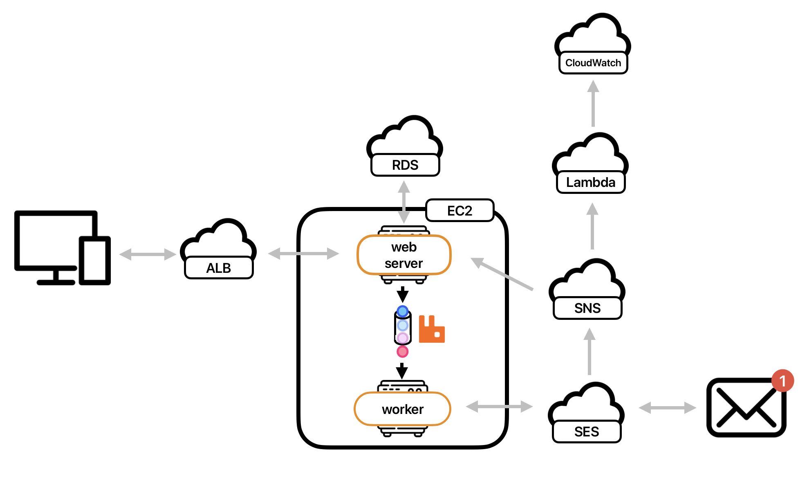

# [simplesend](side-project2023.online)

Email sending service enables you to send, track and analyze friendly.

- Highlighted Features: Email sending, email open tracking, link tracking within emails, data analysis.
- Queue: Utilized Docker to deploy RabbitMQ and delegate user's email sending requests to workers for processing.
  Simple Email Sending: Users can easily send emails on the Back-end using my dedicated [NPM](npmjs.com/package/simplesend) package.
- Email Data Analysis: Subscribed to the SNS topic through a specified HTTPS endpoint to record SES sending information.
- User Authentication for Sending: Authenticated DNS settings using the built-in DNS module of Node.js.
- Instant High Traffic Requests: Implemented Elastic Load Balancing and Auto Scaling to enable the website to handle a high volume of real-time requests at a rate of 200 requests per second.
- Monitoring: Managed SES sending status by SNS and Lambda to store results in CloudWatch Logs for auditing.

## How to use ?

Preparation: Have a ready-to-use domain name (as your sender name).

1. Log in or register on my [website](side-project2023.online/).
2. Click on the image in the top right corner to access your personal page.
3. Take note of the API Key and User ID on the page. Register your domain name and set up DNS settings on your domain hosting website. Once completed, return to perform the verification process. Once the verification is successful, you can proceed to the next step.
4. Download the [NPM](https://www.npmjs.com/package/simplesend) package and use the example below to send email.

```js
import { sendEmailWithAttachment, sendOnlyEmail } from "simplesend";
const body = {
  user_id: 0, //your user ID //required
  nameFrom: "example.com", // your domain name //required
  emailTo: "email@example.com", //required
  emailBcc: "email@example.com",
  emailCc: "email@example.com",
  emailReplyTo: "email@example.com",
  emailSubject: `example`, //required
  emailBodyType: "html", //required //'html' or 'text'
  emailBodyContent: `
    <a href="https://google.com">google</a>`, //required
  trackingOpen: "yes", //required  //'yes' or 'no'
  trackingClick: "yes", //required  //'yes' or 'no'
  trackingLink: "https://google.com", //if you want to track your click ,you have to provide the link you want to track in your html content
};
const apiKey = "your api key it will provide from our web service";
const filePath = "your/file/path";
//send email with attachment
sendEmailWithAttachment(body, filePath, apiKey);

// without attachment
sendOnlyEmail(body, apiKey);
```

5. After sending the email, you can visit our website to view and analyze the sent message records.

## Architecture


