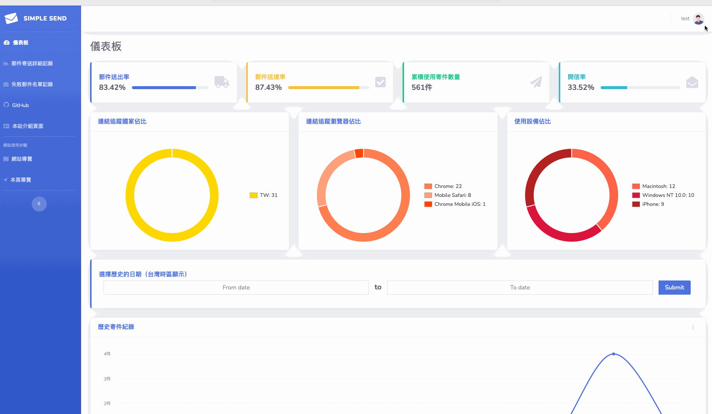
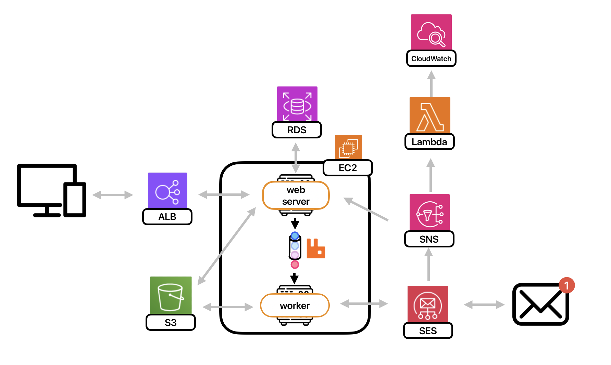

# [simplesend](https://side-project2023.online)

Email sending service enables you to send, track and analyze friendly.

- **Highlighted Features**: Email sending, email open tracking, link tracking within emails, data analysis.
- **Queue**: Utilized Docker to deploy RabbitMQ and delegate user's email sending requests to workers for processing.
- **Simple Email Sending**: Users can easily send emails on the Back-end using my dedicated [NPM](https:npmjs.com/package/simplesend) package.
- **Email Data Analysis**: Subscribed to the SNS topic through a specified HTTPS endpoint to record SES sending information.
- **User Authentication for Sending**: Authenticated DNS settings using the built-in DNS module of Node.js.
- **Instant High Traffic Requests**: Implemented Elastic Load Balancing and Auto Scaling to enable the website to handle a high volume of real-time requests at a rate of 200 requests per second.
- **Monitoring**: Managed SES sending status by SNS and Lambda to store results in CloudWatch Logs for auditing.

## Table of Contents

- [Demo Account](#demo-account)
- [How to use ?](#how-to-use)
- [Architecture](#architecture)
- [Tracking Algorithm](#tracking-algorithm)
- [Stress Testing](#stress-testing)
- [API Document](#api-document)
- [Database Schema](#database-schema)

## Demo Account

- Account: test1@gmail.com
- Password: test

## How to use?

Preparation: Have a ready-to-use domain name (as your sender name).

1. Log in or register on my [website](https://side-project2023.online/).

   

2. Click on the image in the top right corner to access your personal page.
3. Take note of the API Key and User ID on the page. Register your domain name and set up DNS settings on your domain hosting website. Once completed, return to perform the verification process. Once the verification is successful, you can proceed to the next step.
   
4. Download the [NPM](https://www.npmjs.com/package/simplesend) package and use the example below to send email.

```js
import { sendEmailWithAttachment, sendOnlyEmail } from "simplesend";
const body = {
  user_id: 0, //your user ID //required
  nameFrom: "example.com", // your domain name //required
  emailTo: "email@example.com", //required
  emailBcc: "email@example.com",
  emailCc: "email@example.com",
  emailReplyTo: "email@example.com",
  emailSubject: `example`, //required
  emailBodyType: "html", //required //'html' or 'text'
  emailBodyContent: `
    <a href="https://google.com">google</a>`, //required
  trackingOpen: "yes", //required  //'yes' or 'no'
  trackingClick: "yes", //required  //'yes' or 'no'
  trackingLink: "https://google.com", //if you want to track your click ,you have to provide the link you want to track in your html content
};
const apiKey = "your api key it will provide from our web service";
const filePath = "your/file/path";
//send email with attachment
sendEmailWithAttachment(body, filePath, apiKey);

// without attachment
sendOnlyEmail(body, apiKey);
```

5. After sending the email, you can visit our website to view and analyze the sent message records.


## Architecture



## Tracking Algorithm

### Open Tracking

We employ a small tracking pixel as a method for open tracking. When the user opens the email, the tracking pixel is triggered, establishing a connection with our server. Parameters are added to the URL to differentiate it as an open tracking email and include the email's ID for tracking and recording purposes.

### Click Tracking

This feature is enabled only when the user inserts a link in the email. We replace the specified link in the sender's email content to redirect to our website. Parameters are appended to the URL to indicate it as a click tracking link. The parameters include a JWT token with a payload containing the original website's link and the email's ID. This approach eliminates the need to store the original website's link in our database, reducing database access frequency. After recording the necessary information, we redirect back to the original website.

## Stress Testing

### Test Scenario

The test scenario involves multiple users simultaneously using my mailing API. Assuming a busy shopping season, a large number of users on my platform will send purchase confirmation emails to their members. Let's assume there are 25 active users on the platform, and each user sends 8 emails per second for a duration of 90 seconds (resulting in a total of 18,000 requests within 90 seconds).

### Test Objective

The mailing API is a critical feature of the platform, primarily targeting backend systems of e-commerce websites. As the website has recently launched without any advertisements, we have gradually acquired 25 sets of active users, all of whom are interested in the shopping season. Among these 25 users, each has approximately 1,000 followers. Considering the high popularity of the shopping season, around 50% of the followers are expected to place orders, resulting in a minimum of 480 emails that need to be sent. With a rate of 8 emails per second, it would take approximately 63 seconds to complete the task. However, considering potential sporadic customers, we extend the duration to 90 seconds.

### Testing Approach

To perform the stress test, we will be using k6.

Request Frequency: 200 requests per second
Concurrent Users: 25 users
Test Duration: 90 seconds

### Test Results

#### Before Scaling: One EC2 Instance

The actual processing capacity reached 27% of the estimated volume, with the longest response time being 40 seconds and a median response time of approximately 5 seconds. To achieve the estimated volume, auto scaling is required with at least 4 EC2 instances.


#### After Scaling: One to Four EC2 Instances

In this test, the scaling was configured with a default of one instance and a maximum of three instances (excluding the original instance). The results indicate that the actual processing capacity exceeded the expected number of requests to be handled within 90 seconds.


### Review and Conclusion

Considering the need to handle exceptionally high traffic in a short period, auto scaling might not be suitable due to the warm-up time required. Instead, it is advisable to determine the required number of instances beforehand, in anticipation of the expected traffic influx.

## API Document

[https://side-project2023.online/api-docs/](https://side-project2023.online/api-docs/)

## Database Schema


